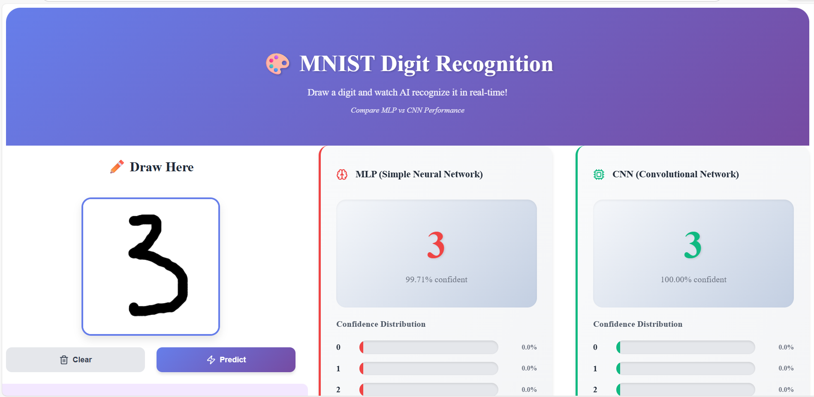

# MNIST Digit Classifier — CNN & MLP

A handwritten digit recognition system built using Deep Learning that classifies digits (0–9) from uploaded images.
The project compares a Multilayer Perceptron (MLP) and a Convolutional Neural Network (CNN) to demonstrate why CNNs perform better on image data.

## 🚀 Features

- Predict handwritten digits from drawing numbers
- Two model architectures:
  - MLP (Baseline Model)
  - CNN (Optimized Model)
- Image preprocessing using OpenCV
- REST API backend (FastAPI)
- Real-time prediction
- Accuracy comparison between models

## 🧠 Model Architectures

### 1) Multilayer Perceptron (MLP)

A simple fully connected neural network used as a baseline.

**Pipeline:**
```
Flatten → Dense → ReLU → Dense → Softmax
```

**Purpose:**
- Demonstrates limitations of dense networks for image data
- Provides baseline accuracy for comparison

### 2) Convolutional Neural Network (CNN)

A deep learning model designed to capture spatial patterns in images.

**Architecture:**
```
Conv2D → ReLU → MaxPool
Conv2D → ReLU → MaxPool
Flatten
Dense → ReLU
Dropout
Dense → Softmax
```

**Techniques Used:**
- Batch Normalization
- Dropout (overfitting prevention)
- Data Augmentation

## 📊 Results

| Model | Accuracy | Observation |
|-------|----------|-------------|
| MLP   | ~95%     | Struggles with spatial patterns |
| CNN   | ~99.2%   | High accuracy and generalization |

CNN significantly outperforms MLP because it preserves pixel locality and learns visual features.

## 🏗️ Project Structure

```
mnist-digit-recognizer/
│
├── backend/
│   ├── app.py
│   ├── model/
│   │   ├── train_cnn.py
│   │   └── train_mlp.py
│   ├── utils/
│   │   └── preprocess.py
│   └── requirements.txt
│
├── frontend/
│   └── (UI for image upload & prediction)
│
└── README.md
```

## ⚙️ Installation

### 1) Clone repository
```bash
git clone <repo-url>
cd mnist-digit-recognizer/backend
```

### 2) Create virtual environment (Python 3.10 recommended)
```bash
py -3.10 -m venv .venv
.\.venv\Scripts\activate
```

### 3) Install dependencies
```bash
pip install -r requirements.txt
```

## ▶️ Run the Application

Start backend server:
```bash
uvicorn app:app --reload
```

Server will run at: `http://localhost:5000`

## 📥 API Endpoint

### Predict Digit

**POST** `/predict`

Upload an image containing a handwritten digit.

**Response:**
```json
{
  "prediction": 8,
  "confidence": 0.992
}
```

## 🖼️ Image Preprocessing

Before prediction, the image is:
- Converted to grayscale
- Resized to 28×28
- Inverted (black background → white digit)
- Normalized (0–1 scaling)

This ensures compatibility with MNIST training distribution.

## 🧩 Technologies Used

- Python
- TensorFlow / Keras
- OpenCV
- NumPy
- FastAPI
- Uvicorn

## 📚 Learning Outcomes

- Difference between MLP and CNN for image classification
- Importance of spatial feature extraction
- Preventing overfitting using dropout & augmentation
- Deploying ML model as an API

## 🔮 Future Improvements

- Support multiple digit detection and text recognition
- Deploy to cloud
- Quantized lightweight model for mobile

## Application Screenshots

### Drawing & Prediction Page


## 👨‍💻 Author

**Prakruthi Koteshwar**